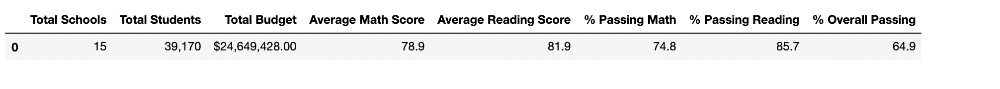

# School_District_Analysis

## Overview of the school district analysis
The superintendent of a school board requests the analysis of stadardized-test results from multiple high schools within the school district. The purpose of the analysis is the provide the school board with insights on performance trends in order to assist in future decisions on school financing and priorities. By analyzing a dataset containing information and results from 15 high schools, the following metrics can be delivered to the school board:
  - Top and bottom performing schools
  - Averge scores and percentages
  - School performance based on funding
  - School performance based on size
  - School performance based on the type of school

After the analysis, the school board has notified the chief data scientist in the school district that the test results from the 9th grade class at Thomas High School has reported cases of academic dishonesty. In order to uphold state-testing standards, all scores from 9th graders at Thomas High School must be replaced with "Nan" and then the school district analysis must be repeated with the new values. The new results will be compared with the results from the prior analysis and any changes will be reported the the school board. 

## Results
### How is the district summary affected?
Before altering the scores for the Thomas High School 9th graders, the summary statistics from all schools are shown in the following image:

After changing the scores for the 9th graders at Thomas High School, this is how the data is changed:

The new data tell us there has been minimal changes in the overall results from the first analysis to the second. We do see a slight decrease in almost all columns, except for the average reading score. 

### How is the school summary affected?
#### First Analysis

#### Refactored Analysis

Thomas High Schools overall statistics are reduced fractionally after removing scores from their 9th grade test takers. 

### How does replacing the ninth graders’ math and reading scores affect Thomas High School’s performance relative to the other schools?
Thomas High School's performance is unchanged after the second analysis, leaving them the second most successful school in the district. Their overall passing percentage went from 90.948012% to 90.630324%. Despite evidence of academic dishonesty from their younger students, the core of the high school students performed superbly in both math and reading tests. 

### How does replacing the ninth-grade scores affect the following:
#### Math and reading scores by grade
Math scores decreased by a tenth of a pecentile while reading scores remained the same in the overall results from District Summary Dataframe. 

#### Scores by school spending
There is not affect on the scores by school size after adjusting the data. 

#### Scores by school size
There is no affect on the scores by school size after adjusting the data.

#### Scores by school type
There is no affect on the scores by school type after adjusting the data. 

## Summary
Overall there is a minimal change in all four categories. Scores by school spending, school size and school type remain as they were in the prior analysis. The only change occurs in the math and reading scores by grade, where the average math score for all schools goes from 79.0 to 78.9. 
